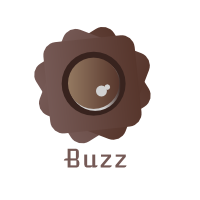

# Buzz design references

As we don't have resources for this project we've decided to generate a random logo using some online tools and also try to find a color palette using the same approach. We will improve this document as we refine our design.

## Logo:

## Color palette:

* Wenge: #755955
* Dark liver: #57362C
* Shadow: #947961
* Bistre: #38231E
* Fantasy: #F9E096

## Design schema

We follow the [Material Design](https://material.io) style implemented thanks to [Material UI](http://www.material-ui.com/#/) react components